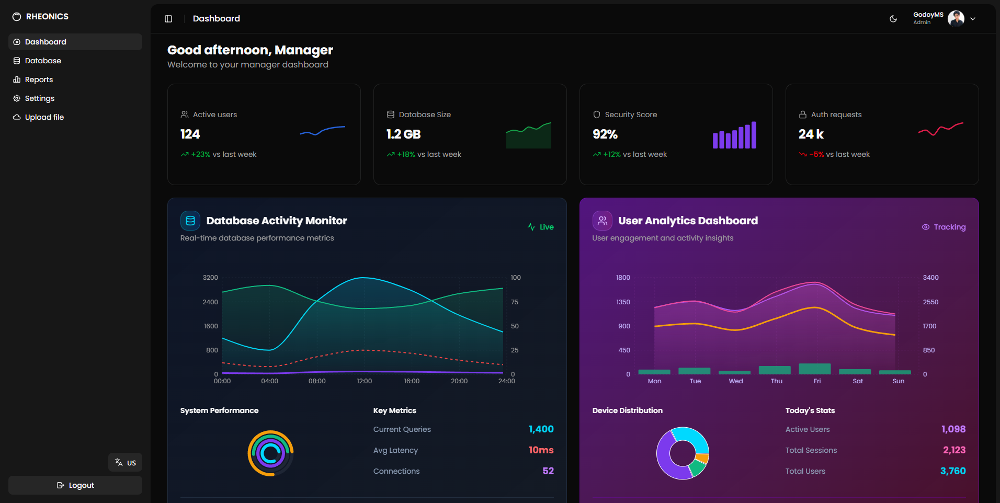

# Rheonics Dashboard

##  Screenshot



## Deployemnt

You can visit the live app at:  
👉 [https://rheonics-dashboard.vercel.app/](https://rheonics-dashboard.vercel.app/)


## Installation
Clone the repository 

```bash
git clone https://github.com/GodoyMS/rheonics-dashboard.git
cd rheonics-dashboard

```

Install dependencies :

```bash
npm run install

```

Run the development server:

```bash
npm run dev

```

Open [http://localhost:3000](http://localhost:3000) with your browser to see the result.

